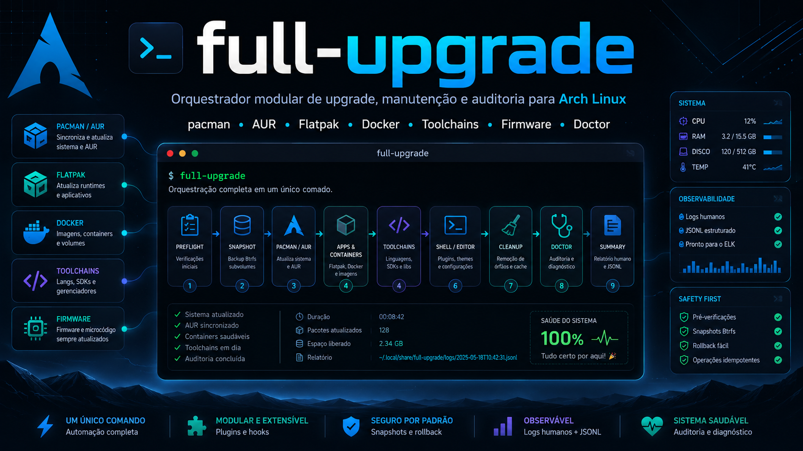

<!-- markdownlint-disable MD013 MD033 MD041 -->

<div align="center">



<br>

<a href="https://github.com/bernardopg/full-upgrade/releases/latest"></a>
<a href="https://github.com/bernardopg/full-upgrade/actions/workflows/ci.yml"></a>


<a href="LICENSE"></a>

<p>
  <b>Um comando.</b> Atualiza sistema, AUR, runtimes, toolchains, containers, firmware
  e plugins de shell/editor — e ainda audita a saúde da máquina com logs humanos e JSONL.
</p>

<a href="#instalação"><b>Instalação</b></a> ·
<a href="#uso-rápido"><b>Uso</b></a> ·
<a href="#modos-e-filtros"><b>Modos</b></a> ·
<a href="#doctor"><b>Doctor</b></a> ·
<a href="#configuração"><b>Configuração</b></a> ·
<a href="#contribuindo"><b>Contribuir</b></a>

</div>

---

`full-upgrade` foi feito para quem mantém uma estação Arch com muitas camadas:
pacotes oficiais, AUR, Flatpak, Docker, linguagens, CLIs de IA, firmware, shell,
editor e componentes de desktop. A proposta é simples: um comando, passos
declarados, execução rastreável e um resumo final que mostra o que atualizou, o
que falhou, o que virou aviso e o que ainda exige ação manual.

```text
full-upgrade
  -> preflight
  -> snapshot e mirrors
  -> pacman / AUR
  -> apps, containers e firmware
  -> toolchains de linguagem
  -> shell, editor, Hyprland e CLIs
  -> limpeza
  -> doctor
  -> resumo + log + JSONL
```

## Destaques

| Área | O que entrega |
| --- | --- |
| Execução modular | Entrypoint fino em `full-upgrade.sh`, bibliotecas em `lib/*.sh` e steps por domínio em `lib/steps/*.sh`. |
| Catálogo técnico | Steps declarados com categoria, tags, efeito, timeout, dependências e função de implementação. |
| Segurança operacional | Lock com `flock`, validação de sudo, keepalive controlado, timeouts por step, dry-run e filtros por categoria. Elevação configurável (`sudo`/`doas`/`run0`/`sudo-rs`). |
| Arch completo | `pacman`, AUR via `paru`/`yay`/`pikaur`, keyring, mirrors, snapshot btrfs, `.pacnew/.pacsave`, órfãos e cache. |
| Ecossistema do usuário | Flatpak, Snap, Docker, npm, pnpm, Bun, Deno, pip, pipx, uv, Poetry, Rust, Cargo, Go, .NET, Ruby, ghcup e Arduino. |
| IA & IDE | CLIs de IA (Claude, Codex, Copilot, Gemini, Qwen, Cline, opencode, Ollama, Kimi), servidores **MCP**, Orca IDE (Stably AI) e extensões de IDE da família VSCode (Code/Cursor/Codium). |
| Desktop e firmware | `fwupd`, `bootctl`, Neovim Lazy/Mason, Oh My Zsh, Hyprland plugins e checks de sessão desktop. |
| Doctor | Auditorias de reboot, systemd, journal, fwupd security, pacman, `.pacnew/.pacsave`, boot, rede, SMART/NVMe, btrfs, Python, JavaScript, CLIs de IA, servidores MCP e CVEs oficiais (`arch-audit`). |
| Auditoria & relatórios | Modo `--audit` consolidado, relatório Markdown/JSON (`--report`), histórico/tendência de runs (`--history`) e remediações opcionais (CVEs Rust, scrub btrfs). |
| Observabilidade | Log completo em texto, eventos JSONL por step, links `latest.log`/`latest.jsonl`, resumo opcional em JSON, notificação desktop ao fim e systray daemon opcional. |

## Instalação

### Via AUR (Arch Linux)

Com um helper de AUR (`yay`, `paru`):

```bash
yay -S full-upgrade
# ou
paru -S full-upgrade
```

O pacote AUR instala o executável único em `/usr/bin/full-upgrade`, o exemplo de
configuração em `/usr/share/full-upgrade/config.example` e a licença/documentação
em `/usr/share/{licenses,doc}/full-upgrade/`. Copie o exemplo para começar:

```bash
mkdir -p ~/.config/full-upgrade
cp /usr/share/full-upgrade/config.example ~/.config/full-upgrade/config
```

### Via script de instalação (qualquer distro com Bash 4.3+)

```bash
git clone https://github.com/bernardopg/full-upgrade
cd full-upgrade
./install.sh
full-upgrade --help
```

O instalador copia a aplicação para:

| Caminho | Função |
| --- | --- |
| `~/.local/share/full-upgrade` | Instalação modular com `full-upgrade.sh`, `lib/`, `steps.d/` e `config.example`. |
| `~/.local/bin/full-upgrade` | Symlink para o executável. Garanta que `~/.local/bin` esteja no `PATH`. |
| `~/.config/full-upgrade/config` | Configuração inicial criada a partir de `config.example`, sem sobrescrever arquivo existente. |

Também é possível gerar um arquivo único:

```bash
./build.sh
./dist/full-upgrade-standalone.sh --help
```

## Atualização

O `full-upgrade` se mantém atualizado sozinho a partir das releases do GitHub:

```bash
full-upgrade --version      # mostra a versão instalada
full-upgrade --update       # baixa e instala a última release (pede confirmação)
full-upgrade --update -y    # atualiza sem perguntar
```

Durante o fluxo normal, o step **"Checar atualização do full-upgrade"** apenas
avisa quando há uma versão nova (não baixa nada) — você decide quando rodar
`--update`. O canal e a origem são configuráveis:

| Chave | Default | Descrição |
| --- | --- | --- |
| `FULL_UPGRADE_REPO` | `bernardopg/full-upgrade` | Repositório `owner/repo` no GitHub. |
| `FULL_UPGRADE_UPDATE_CHANNEL` | `release` | `release` (última tag) ou `main` (bleeding edge). |

No canal `release`, o `--update` baixa o **standalone publicado** junto do seu
`.sha256`, **verifica o SHA-256** e só então instala o binário em
`~/.local/bin/full-upgrade` (guardando o anterior em `…/full-upgrade.bak`). Se o
checksum não bater — download corrompido ou adulterado em trânsito — a
atualização é **abortada antes de qualquer execução**. Requer `curl` e
`sha256sum`/`shasum`. O canal `main` usa o tarball-fonte + `install.sh` e avisa
que, nesse caso, a integridade não é verificada por checksum (apenas TLS).

## Uso Rápido

```bash
full-upgrade
full-upgrade --mode update
full-upgrade --mode doctor
full-upgrade --mode repair
full-upgrade --dry-run
full-upgrade --list-steps
full-upgrade --explain-step "Doctor: saúde de rede"
full-upgrade --config
full-upgrade --audit                       # auditoria de segurança consolidada (read-only)
full-upgrade --report relatorio.md         # grava relatório do último run em Markdown
full-upgrade --report --json               # ou em JSON estruturado
full-upgrade --history                     # tendência dos últimos runs (tabela)
full-upgrade --tray                        # ícone de bandeja (Wayland/AppIndicator ou X11/yad)
```

Comandos úteis no dia a dia:

| Comando | Quando usar |
| --- | --- |
| `full-upgrade` | Fluxo completo: updates, reparos habilitados, limpeza, checks finais e auditorias. |
| `full-upgrade -y` | Execução não interativa, assumindo confirmações seguras. |
| `full-upgrade --dry-run` | Ver o plano de execução sem rodar comandos mutáveis. |
| `full-upgrade --mode update` | Atualizar e limpar, pulando `repair` e `doctor`. |
| `full-upgrade --mode doctor` | Focar nas auditorias de saúde. O fluxo ainda passa pelo preflight compartilhado. |
| `full-upgrade --mode repair` | Rodar apenas reparos conhecidos, além dos steps compartilhados necessários. |
| `full-upgrade --only lang` | Rodar apenas steps de uma categoria, tag **ou nome exato** (aceita lista por vírgula). Ex.: `--only "Atualizar Ollama,doctor"`. |
| `full-upgrade --resume` | Re-rodar apenas os steps que **não** fecharam `ok` no último run real (`warn`/`todo`/`fail`), além de core/final. Sem pendências → sai sem rodar. |
| `full-upgrade --skip-category slow` | Pular steps marcados com uma tag específica. |
| `full-upgrade --skip "Atualizar ghcup"` | Pular um step pelo nome exato. |
| `full-upgrade --json` | Imprimir uma linha JSON de resumo ao final. |
| `full-upgrade --audit` | Auditoria de segurança consolidada (CVEs oficiais/AUR/Rust, firmware, btrfs), sem mutar. |
| `full-upgrade --report [ARQ]` | Gerar relatório do último run em Markdown (ou `--report --json`). |
| `full-upgrade --history` | Ver histórico/tendência dos runs gravados (ou `--history --json`). |
| `full-upgrade --config` | Mostrar caminhos, valores efetivos em uso e um exemplo de configuração. Também aponta chaves do config com cara de erro de digitação (typo-guard) e sugere a correta. |
| `full-upgrade --config-example` | Imprimir só o config de exemplo (sem cores), ideal para criar o arquivo via `>`. |
| `full-upgrade --quiet` | Reduzir output no terminal e manter o detalhe no log. |
| `full-upgrade --restart-services` | Permitir reinício de serviços apontados por `needrestart`/`checkservices`. |
| `full-upgrade --tray` | Iniciar o systray daemon: ícone multi-estado, menu e notificações. Em Wayland usa AppIndicator; em X11 usa `yad --notification`. |
| `full-upgrade --tray --enable` | Habilitar autostart XDG em `~/.config/autostart/full-upgrade-tray.desktop`. |
| `full-upgrade --tray --status` | Mostrar o último estado cacheado do systray, sem rede. |
| `full-upgrade --tray --check` | Recalcular o estado agora (usa `checkupdates`/AUR, faz rede) e sair. |

## Systray Daemon

O `full-upgrade` inclui um applet opcional de bandeja. Em sessões Wayland
(Hyprland/DankMaterialShell, KDE, barras com StatusNotifier) ele usa
AppIndicator via Python/GI quando disponível; em X11 mantém o backend
`yad --notification --listen`. Ele mostra o estado da máquina com ícones simples:

| Estado | Prioridade | Significado |
| --- | --- | --- |
| `running` | 1 | Há um `full-upgrade` rodando (lock ativo). |
| `error` | 2 | O último run registrou `fail`. |
| `attention` | 3 | O último run deixou `todo`/Doctor pendente, como reboot ou ação manual. |
| `updates` | 4 | Há updates de repositório/AUR disponíveis. |
| `idle` | 5 | Sem updates nem pendências conhecidas. |

Uso:

```bash
sudo pacman -S python-gobject libayatana-appindicator yad libnotify pacman-contrib
full-upgrade --tray --check     # computa o primeiro estado
full-upgrade --tray             # inicia o applet
full-upgrade --tray --enable    # autostart via XDG
```

O clique esquerdo roda `full-upgrade` em um terminal. O menu do clique direito
inclui executar o fluxo completo, rodar `--mode doctor`, verificar agora, abrir o
último log e sair. Se o terminal não for detectado, defina `TRAY_TERMINAL` no
config; `xdg-terminal-exec` é a opção mais confiável quando disponível.

Hyprland/DankMaterialShell usa StatusNotifier e exibe o backend AppIndicator.
GNOME Shell não expõe systray/AppIndicator nativamente; use uma extensão como
“AppIndicator and KStatusNotifierItem Support” para o ícone aparecer.

## Modos e Filtros

O script combina modos formais com filtros de catálogo:

| Modo | Escopo |
| --- | --- |
| `full` | Padrão. Executa o fluxo completo disponível no ambiente. |
| `update` | Updates e limpeza, sem reparos mutáveis opcionais e sem doctor. |
| `doctor` | Auditorias e checks de saúde, preservando steps compartilhados de preflight/finalização. |
| `repair` | Reparos conhecidos, sem limpeza. |

Filtros:

```bash
full-upgrade --only doctor
full-upgrade --only docker
full-upgrade --only network
full-upgrade --only manual                       # só os apps fora de gestor de pacote
full-upgrade --only "Atualizar Ollama"          # nome exato de step
full-upgrade --only "lang,Doctor: saúde de rede" # categoria/tag + nome, em lista
full-upgrade --resume                            # só os steps não-ok do último run
full-upgrade --skip-category aur
full-upgrade --skip-category cleanup
FULL_UPGRADE_SKIP="Atualizar ghcup,Atualizar gems de usuário" full-upgrade
```

Categorias e tags vêm do catálogo. Para descobrir os nomes válidos:

```bash
full-upgrade --list-steps
full-upgrade --explain-step "Atualizar pacotes do sistema e AUR"
```

## Catálogo de Steps

Cada step tem metadados no formato:

```text
nome | categoria | tags | efeito | timeout | dependências | função | descrição
```

Exemplo:

```text
Doctor: saúde de rede
Categoria: doctor
Tags: network,read
Efeito: read
Timeout: 30s
Função: doctor_network_health
Descrição: Verifica DNS e conectividade HTTPS para mirrors Arch.
```

Status possíveis no resumo:

| Status | Significado | Impacto no exit code |
| --- | --- | --- |
| `ok` | Step concluído. | Mantém sucesso. |
| `warn` | Problema não bloqueante ou falha transitória tratada. | Mantém sucesso. |
| `todo` | Requer decisão ou ação manual. | Mantém sucesso. |
| `fail` | Falha operacional real. | Finaliza com exit code `2`. |
| `skip` | Step pulado por filtro, ausência de dependência, ambiente ou dry-run. | Mantém sucesso. |

## O Que Ele Atualiza

| Domínio | Cobertura principal |
| --- | --- |
| Preflight | Lock anti-concorrência, sudo, espaço em `/` e `/boot`, `archlinux-keyring`, backup de configs críticas de `/etc` (`tar.zst` com rotação). |
| Snapshot e mirrors | `snapper`/`timeshift` em btrfs (com pré-flight de espaço), `reflector`/`rate-mirrors` com backup validado da mirrorlist. |
| Sistema | `pacman`, AUR (`paru`/`yay`/`pikaur`), reparos conhecidos de lock, GnuPG/AUR, conflitos locais, limpeza recursiva de órfãos, snapshots antigos do próprio script e `.pacnew/.pacsave`. |
| Apps | Flatpak e Snap quando presentes. |
| Containers | Pull de imagens Docker remotas, detecção rápida de daemon inacessível e aviso de containers usando imagem antiga. |
| Firmware e boot | `fwupdmgr` e `bootctl`. |
| JavaScript | `npm`, pacotes npm globais, `corepack`, `pnpm` e pacotes pnpm globais; runtimes `Bun` e `Deno` (auto-gerenciados, pulam quando gerenciados pelo pacman). |
| Python | `pip --user`, `pipx`, `uv`, Python gerenciado pelo uv e Poetry, com proteção contra conflito `poetry-core` fixado pelo Poetry. |
| Rust | `rustup`, `cargo-install-update`, auditoria com `cargo-audit` e auto-remediação opcional de CVEs de toolchain (`AUTO_FIX_RUST_CVES`). |
| Outras linguagens | Go, .NET, Ruby gems, ghcup e Arduino CLI. |
| Shell/editor/IDE | Oh My Zsh, plugins customizados de Zsh, Neovim Lazy/Mason, Hyprland `hyprpm` e extensões de IDE da família VSCode (Code/Cursor/Codium via `--update-extensions`). |
| IA | CLIs de IA via npm global (Codex, Gemini, Qwen, Cline, 9router…), instaladores próprios (opencode, Ollama via `OLLAMA_SELF_UPDATE`), Kimi, Orca IDE (Stably AI, com reparo de `.desktop`/ícone) e refresh de servidores **MCP** uvx (`MCP_AUTO_UPDATE`). |
| CLIs e extras | Claude Code, Hermes, GitHub Copilot, AdGuard VPN, DankMaterialShell, RTK, OpenClaw, Burp Suite e Wireshark (steps independentes) quando habilitados. |
| Apps manuais | Programas instalados **fora de qualquer gerenciador de pacotes**, cada um com seu step dedicado: Factory **droid** (self-update nativo), **Snyk CLI** e **GitKraken CLI** (binários verificados por sha256) e add-ons do **OWASP ZAP**. O step read-only `Doctor: apps manuais` mapeia tudo em `/usr/local/bin`, `~/.local/bin` e `/opt` e indica o que ainda não tem step. |

Ferramentas ausentes não quebram a execução normal: o step é marcado como
`skip` com o motivo, e o restante do fluxo continua.

### Salvaguardas recentes de manutenção

- **Órfãos recursivos:** `Remover pacotes orfãos` repete a consulta
  `pacman -Qdtq` após cada remoção para capturar dependências que só viram
  órfãs depois da primeira passada. O limite é `ORPHAN_CLEANUP_MAX_ROUNDS`
  (default `5`); se ainda sobrar item, o step vira `todo`, não `fail`.
- **Retenção de snapshots:** `Limpar snapshots full-upgrade antigos` remove
  apenas snapshots cuja descrição contém `full-upgrade pré-upgrade`, mantendo os
  `SNAPSHOT_KEEP` mais recentes. Não toca snapshots manuais/de outras origens.
- **Mirrorlist:** quando `reflector` ou `rate-mirrors` falha, o backup só é
  restaurado se contiver uma linha `Server =` ativa. Backup vazio ou totalmente
  comentado não sobrescreve a mirrorlist corrente.
- **Docker:** a checagem inicial usa timeout curto configurável
  (`DOCKER_INFO_TIMEOUT_S`, default `5`) antes de decidir que o daemon está
  inacessível. Isso evita runs presos por dezenas de segundos em máquinas com
  Docker instalado, mas parado ou sem permissão.
- **Poetry / `poetry-core`:** quando o Poetry instalado declara requisito fixo
  para `poetry-core`, o update genérico de `pip --user` adiciona `poetry-core`
  ao ignore efetivo. Isso evita o ping-pong de versão entre o step de pip e o
  step de Poetry.
- **Resumo final:** categorias técnicas são renderizadas por grupos estáveis;
  `flatpak`/`docker`/`snap` aparecem sob **Contêineres**, e `editor`/`shell`
  compartilham um único bloco **Shell / Editor**. Cada grupo mostra tempo total,
  o rodapé destaca o top 3 mais lento e `--json` inclui `category_totals` e
  `slowest_steps`.

## Doctor

O doctor transforma manutenção em diagnóstico acionável. Ele cobre:

| Check | Detecta |
| --- | --- |
| Reboot pendente | Kernel, systemd ou microcode atualizados sem reboot. |
| systemd | Units falhadas no sistema e, quando há sessão/bus disponível, no usuário; se `--user` não puder ser consultado, o doctor registra checagem parcial. |
| Journal | Erros críticos do boot atual, com agrupamento para reduzir ruído. |
| Firmware | Resultado de `fwupdmgr security`. |
| Flatpak | Inconsistências via `flatpak repair --user --dry-run`. |
| Disco | Uso de espaço e inodes em mounts essenciais. |
| Boot | Estado do systemd-boot, kernel/initrd e espaço no ESP. |
| Rede | DNS e HTTPS contra endpoints de mirrors Arch. |
| Serviços antigos | Serviços usando bibliotecas atualizadas via `needrestart` ou `checkservices`. |
| Pacman | Arquivos ausentes via `pacman -Qkq`. |
| pacnew/pacsave | Arquivos `.pacnew`/`.pacsave` pendentes de merge (`pacdiff -o`/`find /etc`). |
| CVEs oficiais | Vulnerabilidades de pacotes do repo oficial via `arch-audit` (corrigível → `warn`, sem correção → `todo`). |
| ALPM | Hooks com falha no journal do boot atual. |
| SMART/NVMe | Saúde de discos via `smartctl` e `nvme`. |
| btrfs | Erros de device acumulados e idade do último scrub em mounts btrfs (auto-remediação opcional via `AUTO_BTRFS_SCRUB`). |
| Tempo de boot | Total via `systemd-analyze time` e as 5 piores units (`blame`). |
| Desktop | Portais, PipeWire, WirePlumber e informações gráficas quando disponíveis. |
| IA | Versões das CLIs de IA detectadas (Claude, Codex, Copilot, Gemini, Qwen, Cline, opencode, 9router, Ollama, Kimi, Hermes), marcando as com método de update conhecido. |
| MCP | Servidores MCP configurados em Claude (`~/.claude.json`) e Codex (`~/.codex/config.toml`), com escopo e runtime (`stdio:npx`, `stdio:uvx`, `remote`). |
| Python/JS | Dependências quebradas, venvs ausentes, interpreters inválidos, conflitos npm/pnpm e diagnóstico acionável de `pip check`. |

## Logs e Automação

Arquivos ficam em:

```text
~/.cache/system-upgrade/
  full-upgrade-<run_id>.log
  full-upgrade-<run_id>.jsonl
  latest.log -> último log humano
  latest.jsonl -> último log estruturado
```

O script mantém os 20 logs mais recentes de cada tipo.

JSONL registra eventos de run e step. Campos importantes:

| Campo | Descrição |
| --- | --- |
| `event` | `run_start`, `step`, `run_end` ou `summary`. |
| `run_id` | Identificador único da execução. |
| `step` | Nome do step, quando aplicável. |
| `status` | `ok`, `warn`, `todo`, `fail` ou `skip`. |
| `duration_seconds` | Duração do step ou do run. |
| `exit_code` | Código retornado pela função do step. |
| `category`, `tags`, `effect`, `timeout` | Metadados vindos do catálogo. |
| `category_totals` | No evento `summary`, totais por grupo do resumo (`ok/warn/todo/fail/skip` + tempo). |
| `slowest_steps` | No evento `summary`, top 3 steps mais lentos não pulados. |
| `reboot_recommendation` | No evento `summary`, motivo de reboot destacado quando houver. |
| `log_file`, `jsonl_file` | Caminhos dos artefatos da execução. |

Exemplos:

```bash
tail -f ~/.cache/system-upgrade/latest.log
jq -c 'select(.event == "summary")' ~/.cache/system-upgrade/latest.jsonl
jq -r 'select(.event == "step" and .status != "ok") | [.status, .step, .reason] | @tsv' ~/.cache/system-upgrade/latest.jsonl
```

## Configuração

Funciona sem configuração. Para personalizar:

```bash
mkdir -p ~/.config/full-upgrade
cp config.example ~/.config/full-upgrade/config
$EDITOR ~/.config/full-upgrade/config
```

Para inspecionar o que está em uso (caminhos, valores efetivos após
config + defaults + auto-detecção, listas de ignore e paths de tools), além de
um exemplo completo de configuração:

```bash
full-upgrade --config
```

Sem o arquivo ao lado (ex.: instalação via standalone), dá para criar o config a
partir do exemplo embutido, sem cores:

```bash
mkdir -p ~/.config/full-upgrade
full-upgrade --config-example > ~/.config/full-upgrade/config
$EDITOR ~/.config/full-upgrade/config
```

Principais chaves:

| Chave | Default | Descrição |
| --- | --- | --- |
| `ENABLE_CUSTOM_TOOLS` | `0` | Só necessário para Burp/Wireshark (que instala `burpsuite`) e para carregar seus plugins de `~/.config/full-upgrade/steps.d/`. As integrações empacotadas (Hermes, AdGuard, Copilot, DMS, OpenClaw, RTK) rodam por presença da ferramenta, sem flag. |
| `LANG_OVERRIDE` | `auto` | Reservado para seleção `auto`, `pt` ou `en`; a saída principal ainda é majoritariamente PT-BR. |
| `SNAPSHOT_TOOL` | `auto` | `auto`, `snapper`, `timeshift` ou `none`. |
| `SNAPSHOT_MIN_FREE_GIB` | `2` | Mínimo de espaço livre em `/` para criar o snapshot; abaixo disso o snapshot é pulado com aviso. `0` desliga a checagem. |
| `SNAPSHOT_KEEP` | `5` | Quantos snapshots `full-upgrade pré-upgrade` manter na limpeza automática. |
| `MIRROR_TOOL` | `auto` | `auto`, `reflector`, `rate-mirrors` ou `none`. |
| `MIN_FREE_GIB` | `2` | Espaço mínimo livre em `/`. |
| `MIN_BOOT_FREE_MIB` | `200` | Espaço mínimo livre em `/boot`. |
| `BACKUP_CONFIGS` | `1` | Arquiva configs críticas de `/etc` em `tar.zst` antes das mutações. `0` desliga. |
| `BACKUP_KEEP` | `5` | Quantos tarballs de backup manter (rotação). |
| `BACKUP_PATHS` | lista de `/etc` | Paths a arquivar, separados por espaço (default cobre `pacman`/boot/`systemd`). |
| `BTRFS_SCRUB_MAX_DAYS` | `30` | Alerta no doctor se o último scrub btrfs em `/` for mais antigo que isso. |
| `BOOT_TIME_WARN_S` | `60` | Alerta no doctor se o boot (`systemd-analyze`) exceder N segundos. |
| `DOCKER_INFO_TIMEOUT_S` | `5` | Timeout curto para detectar daemon Docker inacessível antes de pular o step. |
| `ORPHAN_CLEANUP_MAX_ROUNDS` | `5` | Rodadas máximas de remoção de órfãos para capturar dependências que viram órfãs após a primeira remoção. |
| `AUTO_FIX_RUST_CVES` | `0` | `1` = tenta remediar CVEs de toolchain Rust (`rustup self update`/`update` + `cargo install-update`); `0` = só reporta. |
| `AUTO_BTRFS_SCRUB` | `0` | `1` = inicia `btrfs scrub` quando o scrub estiver vencido/ausente (todos os mounts btrfs); `0` = só reporta. |
| `REPORT_ON_FINISH` | `0` | `1` = grava relatório Markdown do run em `~/.cache/system-upgrade/` ao final. |
| `NOTIFY_ON_FINISH` | `0` | `1` = envia notificação desktop (`notify-send`) com o resumo ao fim do run. |
| `TRAY_CHECK_INTERVAL_M` | `30` | Intervalo, em minutos, entre checagens do systray daemon. O daemon impõe mínimo efetivo de 1 minuto. |
| `TRAY_TERMINAL` | auto | Terminal usado pelo applet para abrir `full-upgrade`; vazio = auto-detecta (`xdg-terminal-exec`, kitty, alacritty, etc.). |
| `TRAY_NOTIFICATIONS` | `1` | `1` = o systray notifica transições úteis (`updates`, `attention`, `error`, retorno a `idle`); `0` = só muda o ícone. |
| `OLLAMA_SELF_UPDATE` | `0` | `1` = reexecuta o instalador oficial do Ollama (`curl \| sh`) no step; `0` = só reporta a versão. |
| `MCP_AUTO_UPDATE` | `0` | `1` = refresca o cache uv dos servidores MCP uvx (rebuild da última no próximo launch); `0` = só doctor read-only. |
| `IDE_EXT_CLIS` | auto | Lista (espaço) de CLIs VSCode-family para atualizar extensões; vazio = autodetect (`code cursor codium …`). |
| `AUR_HELPER` | auto | Helper AUR a usar (`paru`/`yay`/`pikaur`); vazio = autodetecta na ordem `paru > yay > pikaur`. |
| `PRIV_CMD` | auto | Comando de elevação (`sudo`/`doas`/`run0`/`sudo-rs`); vazio = autodetecta (`sudo` por padrão). |
| `FULL_UPGRADE_SKIP` | vazio | Lista (vírgula) de nomes exatos de steps a pular. |
| `FULL_UPGRADE_AUR_IGNORE` | vazio | Pacotes AUR ignorados no update automático. |
| `FULL_UPGRADE_PIP_USER_IGNORE` | vazio | Pacotes `pip --user` ignorados no update genérico. O script ainda adiciona `poetry-core` ao ignore efetivo quando o Poetry instalado fixa uma versão exata. |
| `GCLOUD_BIN` | auto | Override do binário `gcloud`. |
| `COPILOT_BIN` | auto | Override do binário `copilot`. |
| `ADGUARD_BIN` | auto | Override do `adguardvpn-cli`. |
| `OPENCLAW_BIN` | auto | Override do binário `openclaw`. |
| `DMS_PLUGINS_DIR` | `~/.config/DankMaterialShell/plugins` | Diretório dos plugins DankMaterialShell. |
| `RTK_BIN` | auto | Override do binário `rtk` (Rust Token Killer). |
| `ORCA_IDE_BIN` | auto | Override do binário `stably-orca` (Orca IDE). |
| `BURPSUITE_JAVA_BIN` | auto | Java usado pelo fallback de instalação do Burp. |

Como o arquivo é carregado com `source`, use sintaxe Bash válida.

### Filtro de ruído do journal

O check `Doctor: journal erros críticos` agrupa erros do boot atual e filtra ruído
conhecido (ex.: falhas HFP do `bluetoothd`). Para silenciar padrões específicos da
sua máquina, crie `~/.config/full-upgrade/journal-noise.txt` com um regex estendido
(`grep -E`) por linha; linhas em branco e começando com `#` são ignoradas:

```text
# um regex-E por linha
codeisland\.service: (Failed at step CHDIR|Changing to the requested)
ftdi_sio .*Unable to read latency timer
```

## Integrações empacotadas e plugins do usuário

`steps.d/` reúne integrações com ferramentas opcionais. Elas são **empacotadas e
versionadas no repositório** (e embutidas no binário standalone/AUR), e seguem o
mesmo padrão dos steps core.

**Integrações empacotadas — rodam por presença da ferramenta** (sem flag, igual
aos steps de npm/cargo: se a ferramenta não existir, o step entra como `skip`):

| Arquivo | Hook | Roda quando |
| --- | --- | --- |
| `steps.d/10-hermes.sh` | `update_hermes` | `hermes` no PATH |
| `steps.d/20-adguardvpn.sh` | `update_adguardvpn` | `adguardvpn-cli` no PATH ou `ADGUARD_BIN` |
| `steps.d/30-copilot.sh` | `update_copilot_cli` | `copilot` no PATH ou `COPILOT_BIN` |
| `steps.d/40-dms.sh` | `update_dms_plugins` | diretório `DMS_PLUGINS_DIR` existe |
| `steps.d/60-openclaw.sh` | `update_openclaw` | `openclaw` no PATH ou `OPENCLAW_BIN` |
| `steps.d/70-rtk.sh` | `update_rtk` | `rtk` no PATH ou `RTK_BIN` |
| `steps.d/80-orca.sh` | `ensure_orca_ide` | Orca instalado (binário/`ORCA_IDE_PACKAGE`); instala novo só com `ENABLE_CUSTOM_TOOLS=1` |

**Opt-in via `ENABLE_CUSTOM_TOOLS=1`** (porque INSTALA pacote, não só atualiza):

| Arquivo | Hook |
| --- | --- |
| `steps.d/50-burp-wireshark.sh` | `ensure_wireshark`, `ensure_burpsuite`, permissões do Wireshark, atalhos do Burp |

**Plugins do usuário:** com `ENABLE_CUSTOM_TOOLS=1`, arquivos `.sh` em
`~/.config/full-upgrade/steps.d/` também são carregados — a última definição de
função vence, então você pode sobrescrever uma integração empacotada. Para um
step totalmente novo, defina a função, registre a linha em `lib/catalog.sh` e
faça o dispatch no ponto correto de `lib/main.sh`.

## Requisitos

Obrigatórios:

| Requisito | Observação |
| --- | --- |
| Arch Linux ou derivado | O fluxo assume `pacman` e convenções de Arch. |
| Bash 4.3+ | Usa arrays, subscritos negativos e recursos modernos de Bash. |
| `sudo` | Necessário para steps de sistema. Sem sudo, vários steps serão `skip`. |

Opcionais detectados automaticamente:

```text
paru, yay, pikaur, doas, run0, sudo-rs, pacman-contrib, pacdiff, reflector,
rate-mirrors, snapper, timeshift, informant, arch-audit, flatpak, snap, docker,
fwupdmgr, bootctl, npm, corepack, pnpm, bun, deno, python, pipx, uv, uvx, poetry,
rustup, cargo, cargo-install-update, cargo-audit, go, dotnet, gem, ghcup,
arduino-cli, gcloud, claude, codex, copilot, gemini, qwen, cline, opencode,
ollama, kimi, hermes, nvim, code, cursor, codium, hyprpm, needrestart,
checkservices, smartctl, nvme, notify-send, yad, python-gobject,
libayatana-appindicator, xdg-terminal-exec, vulkaninfo, glxinfo
```

## Arquitetura

```text
.
├── assets/icons/             # ícones SVG do app e dos estados do systray
├── res/                      # desktop entry e unit systemd user do systray
├── full-upgrade.sh          # entrypoint: resolve paths, carrega libs e inicia o fluxo
├── install.sh               # instalação em ~/.local/share + symlink no PATH
├── build.sh                 # gera dist/full-upgrade-standalone.sh
├── config.example           # template de configuração do usuário
├── lib/
│   ├── globals.sh           # estado global, paths e flags
│   ├── ui.sh                # cores, símbolos, banner e resumo
│   ├── core.sh              # helpers, run_step, status e timeouts
│   ├── json.sh              # log JSONL e rotação
│   ├── sudo.sh              # validação e keepalive de sudo
│   ├── config.sh            # XDG config e auto-detecção
│   ├── catalog.sh           # metadados dos steps e filtros
│   ├── cli.sh               # flags, modos e saídas precoces
│   ├── report.sh            # relatório Markdown/JSON do run (--report)
│   ├── history.sh           # histórico/tendência de runs (--history)
│   ├── tray.sh              # systray daemon: estado, AppIndicator/yad, menu e notificações
│   ├── main.sh              # ordem de execução
│   └── steps/               # implementação por domínio (ai, mcp, manual_apps, ide, audit, doctor…)
└── steps.d/                 # hooks opcionais de ferramentas customizadas
```

O padrão central é `run_step "Nome" funcao`. Ele:

1. aplica `--skip`, `--only`, `--skip-category` e `FULL_UPGRADE_SKIP`;
2. respeita `--dry-run`;
3. valida dependências declaradas no catálogo;
4. aplica timeout por step;
5. traduz códigos especiais em `warn` e `todo`;
6. grava log humano e evento JSONL.

## Boas Práticas

Antes de uma execução real:

```bash
full-upgrade --dry-run
full-upgrade --list-steps
```

Para manutenção assistida:

```bash
full-upgrade --mode update --json
full-upgrade --mode doctor --json
```

Para reduzir risco em automações:

```bash
full-upgrade --mode update --no-repair --no-cleanup --json --quiet
```

Para investigar uma falha:

```bash
tail -n 120 ~/.cache/system-upgrade/latest.log
jq -r 'select(.event == "step" and .status == "fail")' ~/.cache/system-upgrade/latest.jsonl
```

## Troubleshooting

| Sintoma | Diagnóstico provável | Ação |
| --- | --- | --- |
| `full-upgrade: diretório lib/ não encontrado` | O symlink não resolve para uma instalação modular válida. | Rode `./install.sh` de novo ou use o standalone gerado por `./build.sh`. |
| Muitos steps `skip` por sudo | Execução sem TTY, sudo ausente ou credencial indisponível. | Rode em terminal interativo ou ajuste os steps para modo sem sudo. |
| `--only`/`--skip-category` rejeita categoria | Token não existe no catálogo. | Use `full-upgrade --list-steps` para copiar categoria/tag válida. |
| Um step demora demais | Timeout por step foi atingido e o status vira `warn`. | Veja `latest.log` e rode `--explain-step` para entender timeout/deps. |
| JSONL parece incompleto | Execução foi interrompida antes do resumo. | Confira eventos `run_start`, `step` e `run_end` em `latest.jsonl`. |
| Doctor retorna `todo` | O script encontrou ação manual, não necessariamente uma falha. | Leia o bloco do step no log e decida a correção. |

## Desenvolvimento

Validações rápidas:

```bash
bash -n full-upgrade.sh install.sh build.sh lib/*.sh lib/steps/*.sh steps.d/*.sh
shellcheck -S warning -x full-upgrade.sh lib/*.sh lib/steps/*.sh steps.d/*.sh install.sh build.sh
bats tests/                 # testes unitários (funções puras, sem mutação)
./full-upgrade.sh --help
./full-upgrade.sh --list-steps
./build.sh
```

Ao criar ou alterar steps:

1. mantenha a função no arquivo de domínio em `lib/steps/`;
2. registre metadados em `lib/catalog.sh`;
3. chame o step em `lib/main.sh`;
4. defina timeout realista;
5. use `RC_WARN` para problema não bloqueante e `RC_TODO` para ação manual;
6. garanta que dependências ausentes gerem `skip`, não falha desnecessária.

## Apoie o projeto

Se o `full-upgrade` te poupa tempo, considere apoiar o desenvolvimento:

<a href="https://github.com/sponsors/bernardopg"></a>
<a href="https://ko-fi.com/bernardopg"></a>
<a href="https://www.buymeacoffee.com/wctwom9emu"></a>

## Contribuindo

Contribuições são bem-vindas. Veja [CONTRIBUTING.md](CONTRIBUTING.md) para o
fluxo de validação e o padrão de steps, e [SECURITY.md](SECURITY.md) para
reportar vulnerabilidades.

## Licença

MIT. Veja [LICENSE](LICENSE).

<div align="center">
<br>
<sub>Feito com ☕ e Bash por <a href="https://github.com/bernardopg">@bernardopg</a> · <a href="https://github.com/bernardopg/full-upgrade/releases/latest">Última release</a></sub>
</div>
